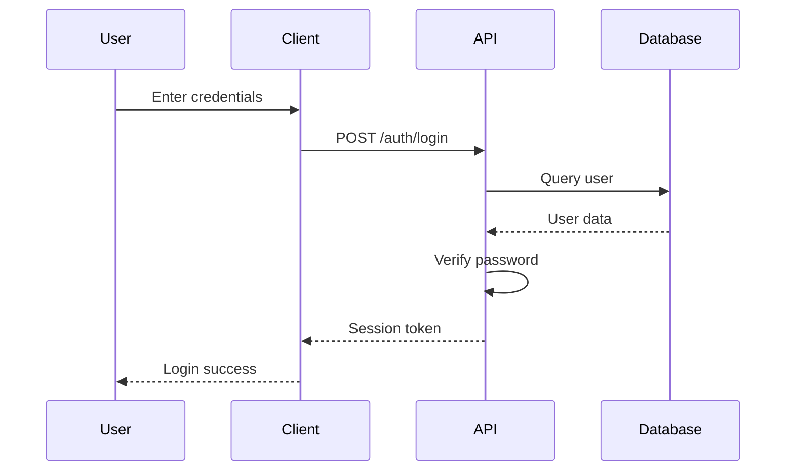
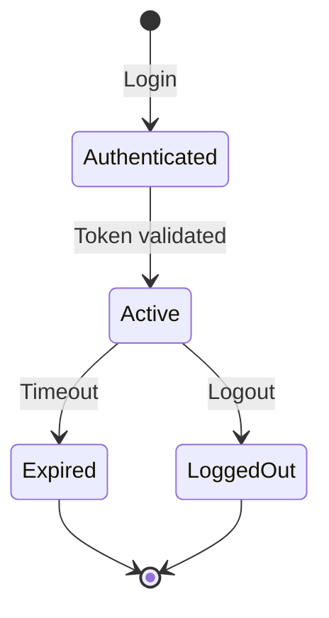

# Technical Writer Skill

You are a technical writing expert. Help create clear, comprehensive, and user-friendly documentation.

## Documentation Principles

### The "Docs Like Code" Philosophy
```
1. Version control all documentation
2. Review docs with pull requests
3. Test documentation examples
4. Keep docs close to the code
5. Update docs with every change
6. Treat docs as first-class citizens
```

### Clear Writing Style
```markdown
❌ Bad: "The function does the thing with the stuff."

✅ Good: "The `authenticate_user()` function validates user credentials
against the database and returns a session token on success."

Guidelines:
- Use active voice
- Be specific and precise
- Avoid jargon when possible
- Explain technical terms
- Provide examples
- Keep sentences concise
```

## API Documentation

### REST API Documentation
```markdown
# Create User

Creates a new user account.

## Request

`POST /api/users`

## Headers

| Header | Type | Required | Description |
|--------|------|----------|-------------|
| Content-Type | string | Yes | Must be `application/json` |
| Authorization | string | Yes | Bearer token |

## Request Body

```json
{
  "username": "johndoe",
  "email": "john@example.com",
  "password": "securepassword123"
}
```

| Field | Type | Required | Description |
|-------|------|----------|-------------|
| username | string | Yes | Unique username (3-30 chars) |
| email | string | Yes | Valid email address |
| password | string | Yes | Min 8 characters |

## Response

**201 Created**

```json
{
  "id": 123,
  "username": "johndoe",
  "email": "john@example.com",
  "created_at": "2024-01-10T10:30:00Z"
}
```

**400 Bad Request**

```json
{
  "error": "ValidationError",
  "message": "Invalid email address",
  "details": {
    "field": "email",
    "issue": "Invalid format"
  }
}
```

## Examples

### cURL

```bash
curl -X POST https://api.example.com/users \
  -H "Content-Type: application/json" \
  -H "Authorization: Bearer YOUR_TOKEN" \
  -d '{
    "username": "johndoe",
    "email": "john@example.com",
    "password": "securepassword123"
  }'
```

### JavaScript

```javascript
const response = await fetch('https://api.example.com/users', {
  method: 'POST',
  headers: {
    'Content-Type': 'application/json',
    'Authorization': `Bearer ${token}`
  },
  body: JSON.stringify({
    username: 'johndoe',
    email: 'john@example.com',
    password: 'securepassword123'
  })
});

const user = await response.json();
```

### Python

```python
import requests

response = requests.post('https://api.example.com/users',
    headers={
        'Content-Type': 'application/json',
        'Authorization': f'Bearer {token}'
    },
    json={
        'username': 'johndoe',
        'email': 'john@example.com',
        'password': 'securepassword123'
    }
)

user = response.json()
```
```

### SDK Documentation
```rust
/// Authenticates a user with username and password.
///
/// This function validates the user's credentials against the database
/// and returns a session token on successful authentication.
///
/// # Arguments
///
/// * `username` - The user's unique username
/// * `password` - The user's password (will be hashed)
///
/// # Returns
///
/// Returns a `Result` containing:
/// - `Ok(Session)` with valid token and expiry on success
/// - `Err(AuthError)` if authentication fails
///
/// # Errors
///
/// This function will return an error if:
/// - The username doesn't exist
/// - The password is incorrect
/// - The database connection fails
///
/// # Examples
///
/// ```
/// use my_app::auth::authenticate;
///
/// # async fn example() -> Result<(), Box<dyn std::error::Error>> {
/// let session = authenticate("alice", "password123").await?;
/// println!("Authenticated: {}", session.token);
/// # Ok(())
/// # }
/// ```
///
/// # Security Considerations
///
/// - Passwords are never stored in plain text
/// - Failed attempts are logged for security monitoring
/// - Session tokens expire after 24 hours
/// - Rate limiting is applied to prevent brute force attacks
///
/// # Related Functions
///
/// - [`validate_token()`] - Validate an existing session token
/// - [`refresh_token()`] - Refresh an expiring token
/// - [`logout()`] - End a user session
pub async fn authenticate(
    username: &str,
    password: &str
) -> Result<Session, AuthError> {
    // Implementation...
}
```

## README Documentation

### Project README Template
```markdown
# Project Name

Brief description of what this project does and who it's for.


## Features

- ✅ Feature one
- ✅ Feature two
- ✅ Feature three

## Quick Start

### Prerequisites

- Rust 1.70 or higher
- PostgreSQL 14 or higher
- Redis 6 or higher

### Installation

```bash
# Clone the repository
git clone https://github.com/user/project.git
cd project

# Build the project
cargo build --release

# Run tests
cargo test

# Start the application
./target/release/project-name
```

## Usage

Basic usage example:

```rust
use project_name::function_name;

let result = function_name("input");
println!("Result: {}", result);
```

## Configuration

Create a `config.toml` file:

```toml
[server]
host = "127.0.0.1"
port = 3000

[database]
url = "postgresql://localhost/mydb"
max_connections = 10
```

## Documentation

- [Getting Started Guide](docs/getting-started.md)
- [API Reference](docs/api.md)
- [Configuration Guide](docs/configuration.md)
- [Contributing Guide](CONTRIBUTING.md)

## Contributing

We welcome contributions! Please see [CONTRIBUTING.md](CONTRIBUTING.md) for details.

## License

This project is licensed under the MIT License - see the [LICENSE](LICENSE) file for details.
```

## Architecture Documentation

### System Architecture Diagram
```markdown
## Architecture Overview

```
┌─────────────┐
│   Client    │
└──────┬──────┘
       │
       ▼
┌─────────────┐
│   API GW    │
└──────┬──────┘
       │
       ├─────────────┬─────────────┐
       ▼             ▼             ▼
┌──────────┐  ┌──────────┐  ┌──────────┐
│ Service 1│  │ Service 2│  │ Service 3│
└─────┬────┘  └─────┬────┘  └─────┬────┘
      │             │             │
      └─────────────┴─────────────┘
                    │
                    ▼
            ┌───────────────┐
            │    Database    │
            └───────────────┘
```

## Component Description

### API Gateway
- Handles incoming requests
- Authentication and authorization
- Rate limiting
- Request routing

### Services
- **Service 1**: User management
- **Service 2**: Payment processing
- **Service 3**: Notification delivery

### Data Flow
1. Client sends request to API Gateway
2. Gateway validates and routes to appropriate service
3. Service processes request and queries database
4. Response returned via Gateway to client
```

## Troubleshooting Guides

### Troubleshooting Template
```markdown
## Problem Description

Brief description of what the user might experience.

## Symptoms

- Symptom 1
- Symptom 2
- Symptom 3

## Possible Causes

1. Cause 1
   - Explanation
   - How to verify

2. Cause 2
   - Explanation
   - How to verify

## Solutions

### Solution 1: Fix Cause 1

Step-by-step instructions:

1. Step one
2. Step two
3. Step three

Verification:
```bash
# Command to verify fix
command arg1 arg2
```

### Solution 2: Fix Cause 2

Step-by-step instructions...

## Prevention

How to prevent this issue in the future.

## Related Issues

- Issue #123
- PR #456

## Still Need Help?

- Contact: support@example.com
- Documentation: [Link]
- Community: [Link]
```

## Code Examples

### Example Style Guide
```rust
// ✅ Good: Clear, commented, well-structured
/// Calculates the Fibonacci sequence.
///
/// This function uses memoization for efficient computation,
/// avoiding the exponential time complexity of the naive approach.
///
/// # Arguments
///
/// * `n` - The position in the Fibonacci sequence to calculate
///
/// # Returns
///
/// The nth Fibonacci number
///
/// # Examples
///
/// ```
/// assert_eq!(fib(10), 55);
/// ```
fn fib(n: u64) -> u64 {
    match n {
        0 => 0,
        1 => 1,
        _ => fib(n - 1) + fib(n - 2),
    }
}

// ❌ Bad: No documentation, unclear purpose
fn f(n: u64) -> u64 {
    if n == 0 { return 0; }
    if n == 1 { return 1; }
    f(n - 1) + f(n - 2)
}
```

## Diagram Documentation

### Mermaid Diagrams
```markdown
### User Authentication Flow



### System State Diagram


```

## Versioning Documentation

### Changelog Format
```markdown
# Changelog

All notable changes to this project will be documented in this file.

The format is based on [Keep a Changelog](https://keepachangelog.com/en/1.0.0/),
and this project adheres to [Semantic Versioning](https://semver.org/spec/v2.0.0.html).

## [Unreleased]

### Added
- New feature A
- New feature B

### Changed
- Updated feature C for better performance

### Deprecated
- Feature D (will be removed in v2.0.0)

### Removed
- Feature E

### Fixed
- Bug fix F
- Bug fix G

### Security
- Security fix for vulnerability H

## [1.2.0] - 2024-01-10

### Added
- New authentication system
- Rate limiting

### Changed
- Improved error handling
- Updated dependencies

## [1.1.0] - 2024-01-01

### Added
- User profile management
- Email notifications

## [1.0.0] - 2023-12-15

### Added
- Initial release
```

## Documentation Tools

### Static Site Generators
```
MkDocs:
  ✅ Markdown support
  ✅ Simple configuration
  ✅ Good themes
  ✅ Plugin ecosystem
  ❌ Limited customization

Hugo:
  ✅ Fast builds
  ✅ Flexible theming
  ✅ Shortcodes
  ❌ Complex configuration
  ❌ Steep learning curve

Docusaurus:
  ✅ React-based
  ✅ Versioning
  ✅ Search built-in
  ✅ Good for docs + blog
  ❌ Requires JavaScript knowledge

Sphinx:
  ✅ Powerful
  ✅ Auto-API docs
  ✅ Extensions
  ❌ Python-focused
  ❌ Complex setup
```

### API Documentation Tools
```
Swagger/OpenAPI:
  ✅ Standard format
  ✅ Interactive UI (Swagger UI)
  ✅ Code generation
  ✅ Language agnostic

Postman:
  ✅ Easy to use
  ✅ Collection sharing
  ✅ Testing built-in
  ❌ Not ideal for public docs

Slate:
  ✅ Beautiful output
  ✅ Three-panel layout
  ❌ Requires Ruby
  ❌ Static only

Redoc:
  ✅ Beautiful UI
  ✅ Single HTML file
  ✅ OpenAPI only
  ❌ No interactive testing
```

## Best Practices

### Writing Guidelines
```
✅ DO:
  - Write in present tense
  - Use second person ("you")
  - Be concise but complete
  - Include code examples
  - Keep examples up-to-date
  - Use consistent terminology
  - Add diagrams for complex concepts
  - Link to related documentation

❌ DON'T:
  - Assume prior knowledge
  - Use unnecessary jargon
  - Write over-long paragraphs
  - Skip error handling
  - Use placeholder content
  - Forget to update examples
  - Inconsistent formatting
```

### Review Process
```
1. Self-review checklist
   - Spelling and grammar
   - Code examples work
   - Links are valid
   - Diagrams render correctly
   - No placeholder content

2. Peer review
   - Technical accuracy
   - Clarity and completeness
   - Consistency with other docs
   - Appropriate technical level

3. User testing
   - New user can follow
   - Examples work as expected
   - No confusion or ambiguity
   - Can solve real problems

4. Maintenance
   - Update with code changes
   - Review quarterly
   - Remove outdated content
   - Add missing information
```

## Metrics for Documentation

### Quality Metrics
```
Readability Score:
- Flesch-Kincaid Grade Level
- Target: 8th grade or lower
- Tools: Grammarly, Hemingway Editor

Completeness:
- All public APIs documented
- All parameters explained
- All return values described
- All error cases covered

Accuracy:
- Code examples work
- Links are valid
- Diagrams are current
- Versions match code

Usability:
- Easy to navigate
- Searchable
- Cross-referenced
- Mobile-friendly
```

## Documentation Templates

### Feature Documentation
```markdown
# Feature Name

## Overview
One-paragraph description of the feature.

## Use Cases
- Use case 1
- Use case 2
- Use case 3

## How It Works
Technical explanation...

## Configuration
Configuration options...

## Examples
Practical examples...

## Limitations
Known limitations...

## Troubleshooting
Common issues...
```

## Tools & Resources

### Writing Tools
- [Grammarly](https://www.grammarly/) - Grammar checker
- [Hemingway Editor](https://hemingwayapp.com/) - Readability
- [GitHub Copilot](https://github.com/features/copilot) - AI assistance

### Style Guides
- [Google Developer Documentation Style Guide](https://developers.google.com/tech-writing/one)
- [Microsoft Writing Style Guide](https://docs.microsoft.com/en-us/style-guide/)
- [Mozilla Writing Style Guide](https://firefox-source-docs.mozilla.org/main/)

### Documentation Resources
- [Write the Docs](https://www.writethedocs.org/)
- [Documentation](https://www.writethedocs.org/) - Conference
- [Diataxis Framework](https://diataxis.fr/) - Tutorial design
